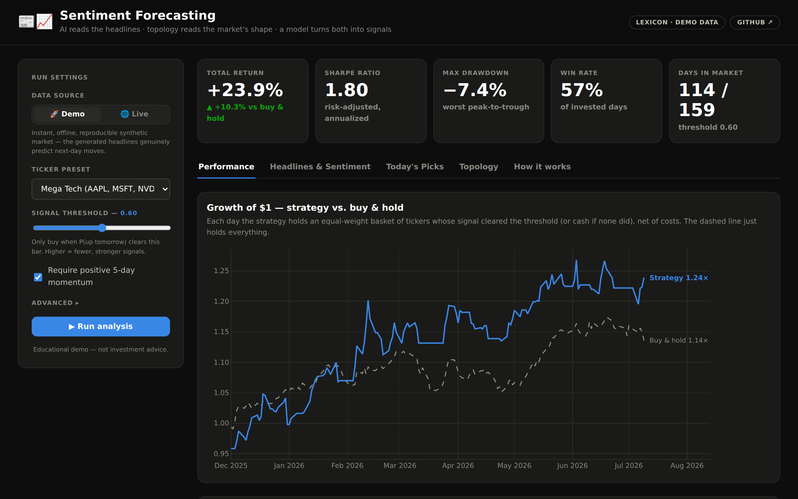
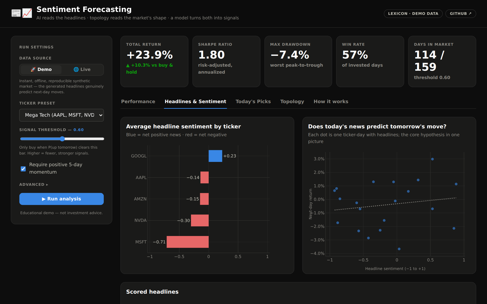
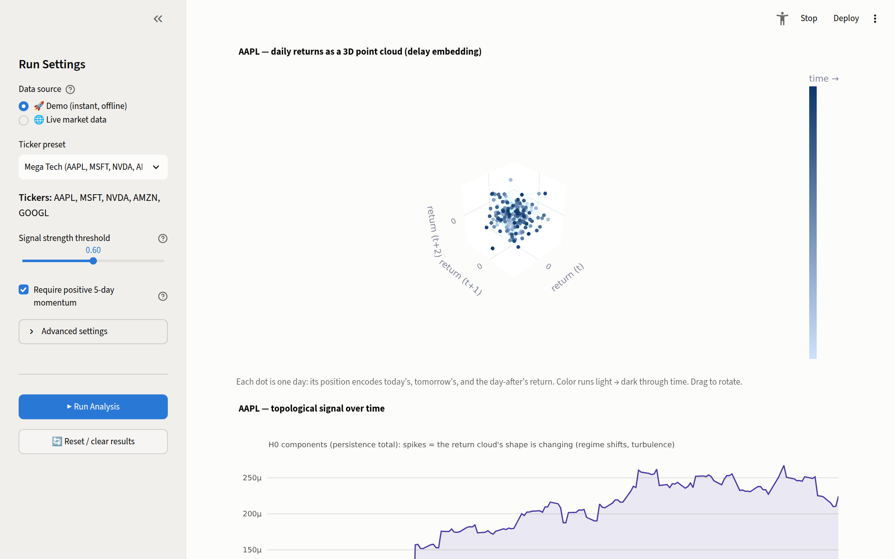
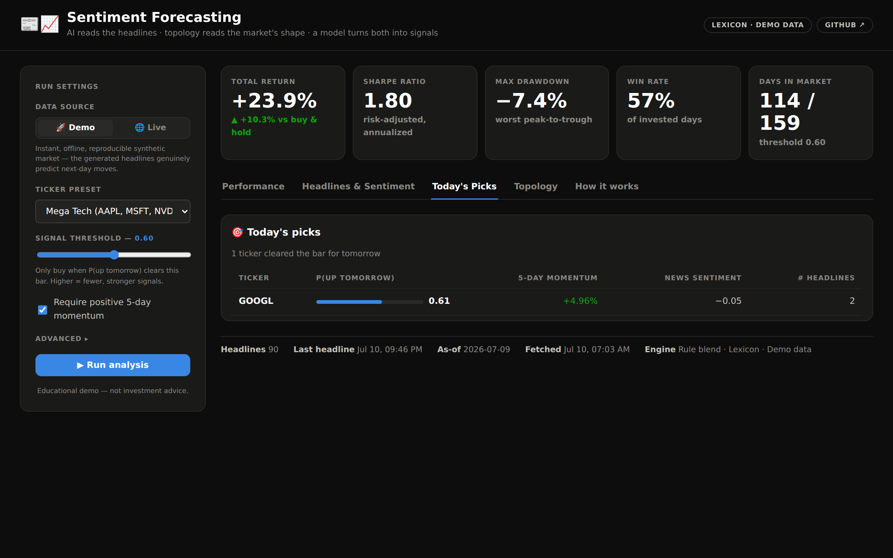

# 📰📈 Sentiment Forecasting

[](https://github.com/maniic/Sentiment-Forecasting/actions/workflows/ci.yml)


**AI reads the day's financial headlines, topology measures the market's "shape", and a
machine-learning model turns both into trading signals — backtested against buy & hold
in a hand-built dark-terminal dashboard.**



## Try it in 30 seconds

```bash
git clone https://github.com/maniic/Sentiment-Forecasting.git
cd Sentiment-Forecasting
pip install -r requirements.txt
python server.py          # → http://localhost:8000
```

The app opens in **Demo mode**: a fully offline, reproducible synthetic market where the
generated headlines genuinely predict next-day moves — so every chart has something to
show instantly, with no API keys, no waiting, and no model downloads. One click switches
to **Live market data** (real headlines, real prices).

## How it works (in plain English)

| Step | What happens | Powered by |
|------|--------------|------------|
| 1. 📰 **Collect** | Pull the last few days of headlines for each ticker | Google News RSS / Yahoo Finance |
| 2. 🧠 **Read** | A finance-tuned AI reads each headline: positive / negative / neutral | FinBERT (lexicon fallback built in) |
| 3. 📐 **Shape** | Recent returns become a 3D point cloud; its *shape* is measured | Topological data analysis |
| 4. 🎲 **Predict** | Sentiment + momentum + shape → probability each ticker rises tomorrow — pick the rule blend or train Logistic / XGBoost / Ensemble live in the app | scikit-learn / XGBoost |
| 5. 📊 **Test** | Simulate trading that signal historically, minus costs, vs. buy & hold | Backtester |

### The sentiment view

Every headline is scored and aggregated per ticker per day — and you can inspect the
core hypothesis directly: does today's news tone predict tomorrow's move?



### The topology view (the unusual part)

Most finance projects stop at returns and volatility. This one also applies
**persistent homology** — a technique from algebraic topology. A sliding window of
daily returns is *delay-embedded* into a point cloud, and the cloud's structure
(connected components H0, loops H1, and how long they persist) becomes a set of
`topo_*` features describing the market's regime: calm markets make tight simple
clouds, turbulent ones make stretched clouds with loops. The dashboard renders the
actual point cloud in interactive 3D so you can see what the math sees.



### Today's picks

The end product: tickers whose probability of rising tomorrow clears your threshold,
with the evidence (momentum, sentiment, headline count) beside each one.



## Architecture

The app is a **FastAPI** JSON API over the analysis pipeline, plus a **hand-built
frontend** (semantic HTML, design-token CSS, framework-free ES modules, Plotly.js for
the interactive charts — vendored, so everything works offline).

```
┌─────────────────────────────────────────────────────────────────────┐
│                         DATA SOURCES                                │
├────────────────┬────────────────┬───────────────────────────────────┤
│  Google News   │   yfinance     │   Demo generator (offline,        │
│  RSS headlines │   news+prices  │   seeded synthetic market)        │
└───────┬────────┴───────┬────────┴───────────────┬───────────────────┘
        ▼                ▼                        ▼
┌─────────────────────────────────┐   ┌──────────────────────────────┐
│        SENTIMENT ENGINE         │   │     TOPOLOGICAL FEATURES     │
│  FinBERT transformer            │   │  Delay embedding             │
│  ↓ graceful fallback ↓          │   │  Vietoris-Rips persistence   │
│  Financial lexicon scorer       │   │  H0/H1 summaries + entropy   │
└───────────────┬─────────────────┘   └──────────────┬───────────────┘
                ▼                                    ▼
┌─────────────────────────────────────────────────────────────────────┐
│   FEATURES → MODELS → BACKTEST   (costs · drawdown · benchmark)     │
└────────────────────────────────┬────────────────────────────────────┘
                                 ▼
┌─────────────────────────────────────────────────────────────────────┐
│   FastAPI  /api/run · /api/config          server.py                │
└────────────────────────────────┬────────────────────────────────────┘
                                 ▼
┌─────────────────────────────────────────────────────────────────────┐
│   Frontend  frontend/ — design-token CSS · vanilla JS · Plotly.js   │
└─────────────────────────────────────────────────────────────────────┘
```

## The design system

The UI is built on a small hand-rolled design system (`design/tokens.css`): a dark
"quant terminal" theme with a chart palette **validated for colorblind safety and
contrast**, tabular numerals everywhere numbers align, and reusable component classes
(stat tiles, badges, tables, tabs, probability bars). Component previews live in
`design/previews/` and are synced to a Claude Design project for visual iteration.
Conventions the charts follow: one y-axis, thin marks, recessive grid, the benchmark is
always dashed gray and direct-labeled, and sentiment polarity is blue↔red with a glyph
so color never carries meaning alone.

## Engineering highlights

- **Runs anywhere.** Heavy dependencies load lazily: no torch? The sentiment engine
  falls back to a transparent financial lexicon. No `giotto-tda`? Topology falls back
  to statistical proxies. No internet? Demo mode simulates the whole market. The UI
  always reports which engine actually ran.
- **No look-ahead bias.** Signals formed on day *t* are evaluated on day *t+1* returns;
  train/test splits are strictly chronological — and when you train an ML model in the
  app, both its quality scores *and* the backtest curve use only the held-out final 20%
  of days, so the model is never graded on data it trained on.
- **Live model training.** Pick Logistic Regression, XGBoost, or a voting Ensemble in
  the sidebar and it trains on that run's features in seconds, reporting out-of-sample
  AUC / accuracy / precision / recall next to the charts.
- **Honest backtesting.** Trading costs, drawdown tracking, win rate, and an
  equal-weight buy-and-hold benchmark on every run.
- **Tested + CI.** 67 pytest tests — schemas, features, news parsing, models, and the
  API itself (including a determinism test for demo mode) — run on every push via
  GitHub Actions.
- **Zero frontend build step.** No node_modules, no bundler: semantic HTML + design
  tokens + ES modules, with Plotly.js vendored for interactive charts offline.

## Deploying it live

The app is a single FastAPI process serving both the API and the static frontend, so it
runs on any host that can execute Python — **not** GitHub Pages or Vercel's serverless
functions, which don't fit a long-lived server with `torch`-sized dependencies.

**Recommended: [Render.com](https://render.com)** — free tier, connect the repo, and it
reads `render.yaml` automatically (Blueprint deploy). Alternatives that work the same
way: [Fly.io](https://fly.io), [Railway](https://railway.app), or
[Hugging Face Spaces](https://huggingface.co/spaces) (Docker SDK) — all read the included
`Dockerfile`.

Two hosted flavors — see **[DEPLOY.md](DEPLOY.md)** for step-by-step instructions:

- **Render** (`render.yaml` + lite `Dockerfile`): fits the free 512MB tier by skipping
  `torch`/`transformers`; the app falls back to its lexicon sentiment engine.
- **Hugging Face Spaces** (`Dockerfile.hf`): the free CPU tier has 16GB RAM, so this
  image ships the **full FinBERT transformer**, pre-downloaded at build time — the
  right choice when the link needs to showcase everything.

```bash
# Render — connects render.yaml automatically, or manually:
#   build: pip install -r requirements-deploy.txt
#   start: uvicorn server:app --host 0.0.0.0 --port $PORT

# Any Docker host (Fly, HF Spaces, Railway, a VPS):
docker build -t sentiment-forecasting .
docker run -p 8000:8000 -e PORT=8000 sentiment-forecasting
```

## Other ways to run it

```bash
# CLI pipeline — prints today's picks and saves equity curve + metrics to output/
python run_pipeline.py --tickers SPY QQQ AAPL
python run_pipeline.py --demo            # same, but fully offline

# Dev server with auto-reload
uvicorn server:app --reload

# Explore the notebook walkthrough
jupyter notebook notebooks/sentiment_forecasting_demo.ipynb

# Run the tests
pytest tests/ -v
```

## Configuration

All knobs live in `src/config.py`:

```python
from src.config import (
    TICKERS,               # Default ticker universe
    PREDICTION_THRESHOLD,  # Signal threshold (default: 0.60)
    DEFAULT_LOOKBACK_DAYS, # News lookback (default: 5)
    TopoConfig,            # TDA parameters
    ModelConfig,           # ML model settings
    StrategyConfig,        # Backtest parameters
)
```

## Project structure

```
├── server.py               # FastAPI app: /api/run, /api/config + static hosting
├── run_pipeline.py         # CLI pipeline
├── frontend/               # Hand-built dashboard (no framework, no build step)
│   ├── index.html
│   ├── css/app.css         # layout on top of the design tokens
│   ├── js/app.js           # state, fetch, rendering
│   ├── js/charts.js        # Plotly.js chart builders (shared dark theme)
│   └── vendor/plotly.min.js
├── design/
│   ├── tokens.css          # design tokens — single source of truth for the UI
│   └── previews/           # component preview cards (synced to Claude Design)
├── src/
│   ├── news.py             # Headline fetching (Google RSS, yfinance old+new schemas)
│   ├── sentiment.py        # FinBERT + lexicon fallback engines
│   ├── tda.py              # Persistent homology features (+ fallback)
│   ├── features.py         # Price/sentiment/topology feature engineering
│   ├── ml.py               # Models: rule blend, logistic, XGBoost, ensemble
│   ├── backtest.py         # Signals, backtester, benchmark, today's picks
│   ├── demo.py             # Seeded synthetic market generator
│   ├── config.py           # Central configuration
│   └── schemas.py          # Column contracts shared across the pipeline
├── tests/                  # 67 pytest tests (pipeline + API)
└── .github/workflows/      # CI: tests + offline API smoke test
```

## Disclaimer

This is an educational project. Backtests on short windows are noisy, the demo market
is synthetic by design, and nothing here is investment advice.

## License

MIT — see [LICENSE](LICENSE).
